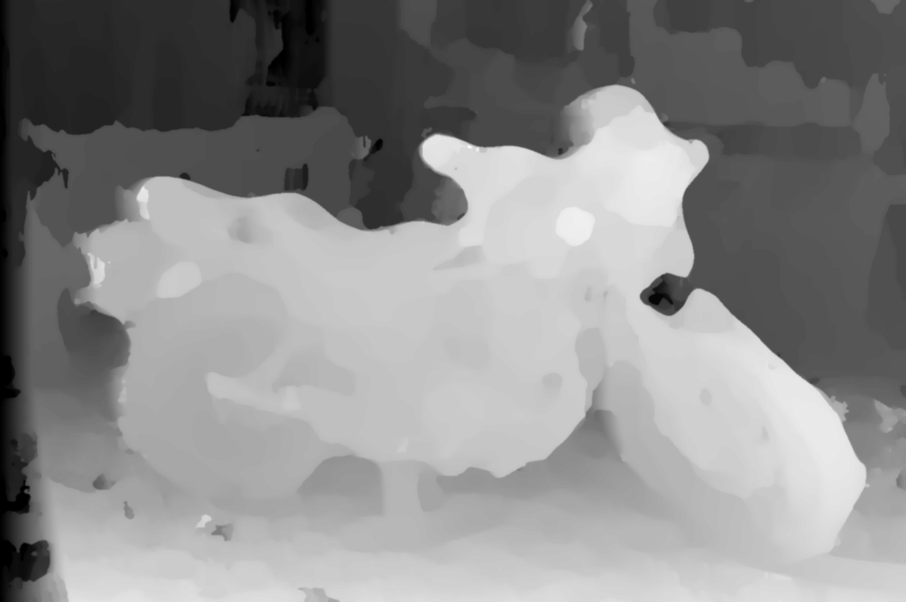
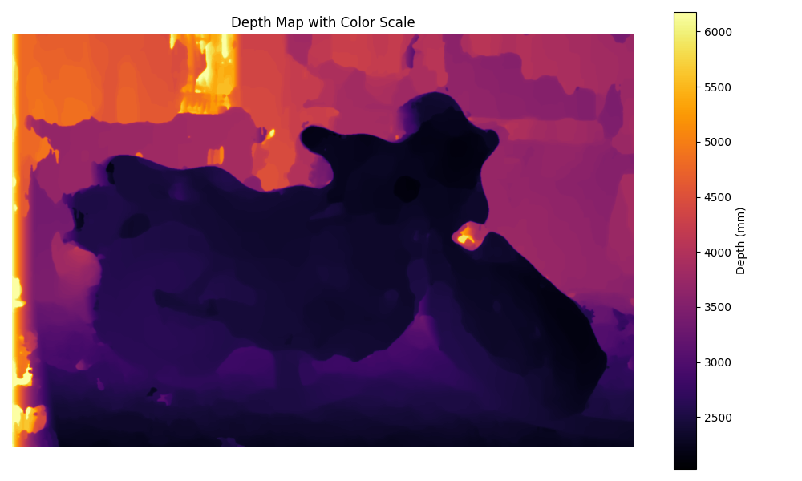

# Stereo Vision Depth Estimation

This project implements a **Computer Stereo Vision** pipeline for generating a **disparity map** and a corresponding **depth map** from a pair of stereo images. It uses Python with common scientific libraries to perform each stage of the processing pipeline — from image preprocessing to 3D depth reconstruction.

---

## Features

- Image preprocessing (grayscale conversion, resizing)  
- Disparity computation using **Sum of Absolute Differences (SAD)**  
- Parallelized processing with **Joblib** for speed  
- Outlier detection and removal  
- Post-processing with median and Gaussian filters  
- Depth map generation using camera calibration parameters  
- Automatic result visualization and export  


---

## Requirements

Make sure you have **Python 3.8+** installed.  
Then install the dependencies:

```bash
pip install -r requirements.txt
```

---

## How It Works

1. **Pre-processing**  
   - Loads stereo images  
   - Converts them to grayscale  
   - Optionally rescales them (default: `scale_factor = 0.5`)  

2. **Disparity Calculation**  
   - Uses a sliding window SAD approach  
   - Parallelized computation per row for faster processing  

3. **Outlier Removal & Post-processing**  
   - Applies median and Gaussian filters  
   - Removes noisy disparities  

4. **Depth Map Generation**  
   - Converts disparity to depth using calibration parameters:
     
     $$\text{Depth} = \frac{f \times B}{d + d_{offs}}$$

     where  
     - *f* = focal length  
     - *B* = baseline  
     - *d* = disparity  
     - *dₒₒₓₛ* = disparity offset  

5. **Output**  
   - Saves grayscale disparity map  
   - Saves colorized depth map with a heatmap color scale  

---

## How to Run

1. Place your stereo image pair and calibration file under a dataset folder (e.g., `data/set1/`):
   ```
   im0.png
   im1.png
   calib.txt
   ```

2. Make sure the calibration file contains at least:
   ```
   cam0=[f,0,cx;0,f,cy;0,0,1]
   doffs=...
   baseline=...
   ```

3. Run the pipeline:
   ```bash
   python main.py
   ```

4. The output files will be saved in:
   ```
   ./data/output/
   ```

   You’ll find files like:
   - `disparity_XXXxYYY.png`
   - `depth_map_XXXxYYY.png`
   - `depth_map_colored_XXXxYYY.png`

---

## Example Output

After running, you should see console output like:

```
Processing ./data/set1/im0.png...
Pre-processing for ./data/set1/im0.png complete.
Image size: (1482, 1000)
Image mode: L
Processing ./data/set1/im1.png...
Pre-processing for ./data/set1/im1.png complete.
Image size: (1482, 1000)
Image mode: L

=== Computing Disparity Map ===
Computing Disparity: 100%|████████████████████████████████████████████████████████████████████████████████████████████████████| 955/955 [07:22<00:00,  2.16it/s]
Disparity calculations complete. Time elapsed: 462.28s

=== Removing Outliers ===
Removing outliers from disparity map...
Detected 38447 outlier pixels.
Outlier removal complete.

=== Post-Processing Disparity Map ===
Post-processing disparity matrix of shape (955, 1437)...
Post-processing complete.

=== Parsing Calibration ===

=== Generating Depth Map ===
Converting disparity map to depth map...
Depth map generation complete.

=== Saving Images ===

=== Processing Complete! ===
```

and generated images similar to:

- **Disparity Map:** Grayscale representation of pixel shifts



- **Depth Map:** Heatmap representing relative distance

